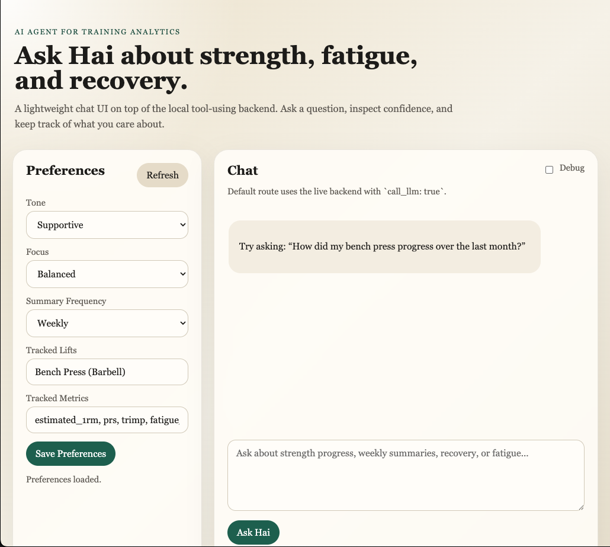

# Hai: AI Agent for Training Analytics

`Hai` is an AI-powered training analytics system that turns workout and recovery data into structured insights about strength progress, fatigue, and recovery trends.

This project combines:

- data ingestion from workout and health sources
- feature engineering and rollups in Python + PostgreSQL
- structured analytics tools for querying training signals
- a constrained AI agent layer that routes user questions to predefined tools
- an API layer that returns debug-friendly or frontend-friendly responses

The long-term goal is to build a production-quality AI coaching assistant that explains patterns in training data without relying on raw-table reasoning or hallucinated metrics.

## Why This Project Exists

Most fitness apps show isolated charts, summaries, or workout logs. This project is built around a different idea:

- ingest raw personal fitness and recovery data
- compute durable analytics features in a backend pipeline
- expose safe, predefined analysis tools
- let an LLM explain those structured results clearly and cautiously

Instead of treating the model as a calculator, `Hai` treats the model as an interpreter sitting on top of a structured analytics system.

<p>
  
</p>

## Current MVP Scope

The current MVP supports:

- Hevy workout ingestion into Postgres
- Apple Health daily recovery extraction
- derived feature tables for training load, recovery, and strength progress
- a tool registry for analytics queries
- a lightweight agent orchestrator that selects tools from user intent
- a local HTTP API endpoint for agent queries
- data quality flags and confidence handling for incomplete recovery data

## Architecture

The system is organized into four practical layers:

1. Raw / Ingestion Layer
- Hevy workout export
- Apple Health export
- raw-to-Postgres ingestion scripts

2. Feature Engineering Layer
- daily training and recovery features
- exercise-level strength progression
- weekly muscle-group and training summaries

3. Analytics / Tool Layer
- predefined functions for strength comparison, fatigue snapshots, recovery trends, and weekly summaries
- structured JSON outputs with quality flags and confidence annotations

4. Agent / API Layer
- user prompt -> tool selection -> tool execution -> structured prompt -> optional LLM answer
- clean API response by default, debug details only when requested

## Repository Structure

```text
hai/
├── app/
│   ├── analytics/      # SQL/Pandas analytics helpers and strength queries
│   ├── api/            # lightweight HTTP API server
│   ├── features/       # derived training/recovery feature builders
│   ├── ingestion/      # raw data ingestion scripts
│   ├── llm/            # tool registry, agent orchestrator, prompt builder, LLM client
│   └── pipeline/       # feature build orchestration
├── data/
│   ├── exercise_reference*.csv
│   └── raw/            # local-only personal health/workout data (ignored from Git)
├── docs/               # architecture notes, prompt specs, tool contracts, evaluation docs
├── tests/              # smoke scripts and prompt examples
├── docker-compose.yml  # local Postgres
└── requirements.txt
```

## Data Model

### Raw / Canonical Tables

- `workouts`
- `sets`
- `apple_workouts`
- `heart_rate_raw`
- `apple_daily_recovery`

### Derived Feature Tables

- `daily_features`
  - daily TRIMP / load
  - resting HR / HRV / sleep
  - baseline deltas
  - ACWR / fatigue proxy

- `exercise_progress`
  - exercise-level volume
  - top weight
  - estimated 1RM
  - PR detection

- `weekly_muscle_features`
  - weekly muscle-group volume and PRs

- `weekly_training_features`
  - weekly strength volume, TRIMP, ACWR, fatigue days, readiness

## AI Agent Design

This project uses a constrained, tool-using AI agent pattern.

The agent does not read raw tables directly. Instead it:

1. receives a user question
2. selects from allowlisted analytics tools
3. executes those tools against structured feature tables
4. assembles a prompt from tool outputs
5. optionally calls an LLM for a natural-language answer

Current allowlisted tools include:

- `compare_strength_windows`
- `get_weekly_training_summary`
- `get_fatigue_snapshot`
- `get_recovery_trend`

Each tool returns:

- `payload`
- `data_quality`
- `quality_flags`
- `confidence`

This makes the system more reliable than letting a model infer directly from raw data.

## API

The local API currently exposes:

- `GET /health`
- `POST /agent/query`

### Example request

```bash
curl -X POST http://127.0.0.1:8000/agent/query \
  -H "Content-Type: application/json" \
  -d '{
    "user_query": "Was I more fatigued in the last 2 weeks?",
    "tool_params": {
      "get_fatigue_snapshot": {
        "date_start": "2026-01-01",
        "date_end": "2026-01-31"
      },
      "get_recovery_trend": {
        "date_start": "2026-01-01",
        "date_end": "2026-01-31"
      }
    },
    "call_llm": false,
    "debug": false
  }'
```

### Example response

```json
{
  "answer": null,
  "confidence": "low",
  "selected_tools": [
    "get_fatigue_snapshot",
    "get_recovery_trend"
  ],
  "quality_flags": [
    "low_hrv_coverage",
    "low_resting_hr_coverage",
    "missing_sleep"
  ],
  "message": "LLM answer not generated. Send `call_llm: true` to return a final natural-language answer."
}
```

Set `debug: true` to include raw tool outputs and the generated prompt for inspection.

## Supported Questions

The current MVP is designed to answer a focused set of question types well:

- strength progress questions
- weekly training summary questions
- fatigue and recovery summary questions
- metric explanation questions

Examples:

- `How did my bench press progress over the last month?`
- `How was my training last week?`
- `Was I more fatigued in the last 2 weeks?`
- `What does HRV SDNN mean here?`

Questions outside these supported categories may require new tools or additional feature work.

## Local Setup

### 1. Create and activate the virtual environment

```bash
cd /Users/lasya/hai
python3 -m venv .venv
source .venv/bin/activate
pip install -r requirements.txt
```

### 2. Start Postgres

```bash
docker compose up -d
```

This starts a local Postgres instance using the credentials in `docker-compose.yml`:

- user: `app`
- password: `app`
- database: `health`

### 3. Prepare local data

This repo expects personal source files locally, but they are intentionally excluded from version control:

- `data/raw/workout_data.csv`
- `data/raw/apple_health_export/export.xml`

### 4. Run ingestion / feature pipelines

```bash
python app/ingestion/ingest_hevy.py
python app/ingestion/apple_daily_recovery.py
python app/pipeline/build_all_features.py
```

### 5. Start the API

```bash
python -m app.api.server
```

### 6. Smoke test the agent path

```bash
python tests/agent_orchestrator_smoke.py
```

## Docs

Project thinking and WIP specs live in `docs/`, including:

- prompt design
- tool contracts
- evaluation tracking
- architecture notes
- physiology context for recovery / fatigue interpretation

Useful files:

- [`docs/assistant_capabilities.md`](docs/assistant_capabilities.md)
- [`docs/metrics_catalog.md`](docs/metrics_catalog.md)
- [`docs/prompt_examples.md`](docs/prompt_examples.md)
- [`docs/gpt_prompt.txt`](docs/gpt_prompt.txt)
- [`docs/llm_tools.md`](docs/llm_tools.md)
- [`docs/metrics_log.md`](docs/metrics_log.md)
- [`docs/architecture.md`](docs/architecture.md)

## What Makes This Different

This is not a generic chatbot wrapper around fitness data.

It is an applied AI systems project focused on:

- analytics-backed reasoning
- agentic tool orchestration
- confidence-aware outputs
- health-related caution and uncertainty handling
- a production-friendly backend design

That makes it closer to an AI product / applied AI engineering project than a prompt-only demo.

## Current Limitations

- raw Apple workout ingestion is still partially notebook-driven
- some planned modules are still placeholders or WIP
- the current API server is intentionally lightweight for MVP
- model invocation is optional and not enabled by default
- data quality can be sparse depending on recovery signal coverage

## Roadmap

- enable full LLM answer generation by default
- improve prompt templates and answer formatting
- expand analytics tool coverage
- add evaluation runs and regression tracking
- add notification workflows for summaries and alerts
- optionally expose the tool layer through a more standard agent/MCP interface
- add a lightweight frontend chat experience

## Privacy and Data Handling

This repository is designed so that personal health exports and raw workout data can stay local.

Recommended practice:

- keep `data/raw/` out of Git
- keep `.env` out of Git
- avoid publishing personal exports, XML dumps, or large raw files
- publish only code, schemas, examples, and small safe reference data

## Portfolio Positioning

This project can be positioned as:

`AI agent for training analytics built with Python, PostgreSQL, structured tool orchestration, and LLM-based explanation layers.`

Keywords relevant to this project:

- AI agent
- applied AI
- LLM orchestration
- analytics backend
- data pipelines
- feature engineering
- PostgreSQL
- tool calling
- prompt engineering
- reliability / evaluation

## Status

Active work in progress. The current repository reflects an MVP backend and evolving agent architecture.
