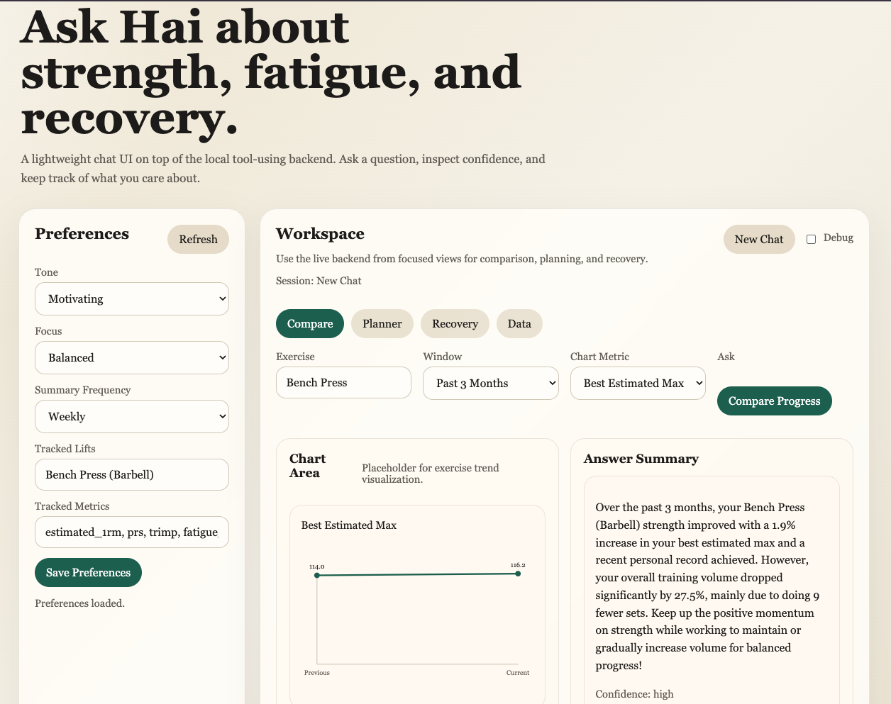
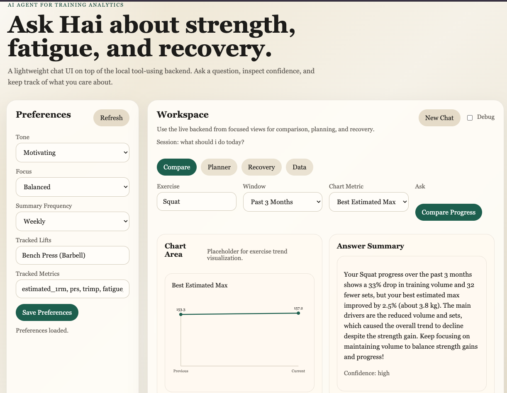
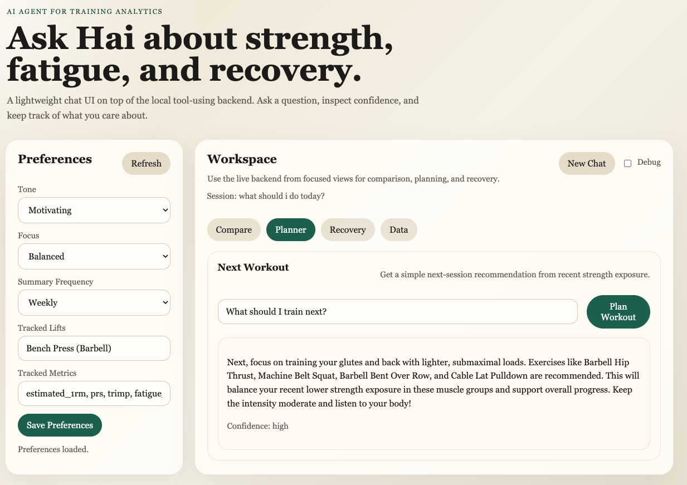
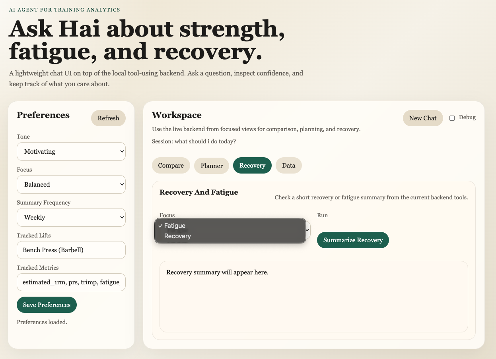
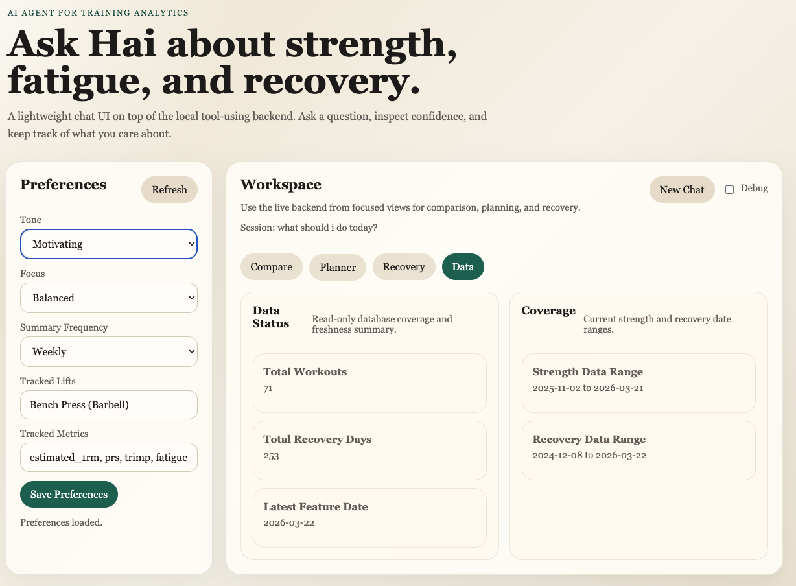

# Hai: AI Agent for Training Analytics

Hai is a local-first AI training analytics assistant that answers questions about strength progress, fatigue, recovery trends, and next-session planning using structured workout telemetry.

Instead of querying raw fitness tables directly, Hai routes user questions through domain-specific analytics tools and generates explanations grounded in engineered training features.

---

## Demo Screens

### Strength Trend Comparison (Bench Press)

Compare estimated strength, volume, and PR changes across time windows.



### Strength Trend Comparison (Squat)

Exercise-specific comparison across recent training windows.



### Next Workout Planner

Suggests the next training focus using recent muscle exposure.



### Recovery & Fatigue Summary

Summarizes recovery signals from HRV, resting HR, and sleep-derived features.



### Data Coverage Dashboard

Shows database coverage and feature availability across strength and recovery signals.



---

## What This Project Demonstrates

This project implements a constrained tool-using LLM agent architecture:

user question  
→ tool selection  
→ feature-table analytics execution  
→ structured payload  
→ confidence-aware explanation layer

Instead of letting an LLM infer from raw tables, Hai interprets outputs from engineered analytics features.

Core capabilities:

- strength progress comparison across time windows
- next-session workout recommendation engine
- fatigue and recovery summaries
- confidence-aware outputs with quality flags
- structured feature-table reasoning instead of raw-data prompting
- browser-based task-focused UI for comparison, planning, recovery, and data coverage

---

## Architecture Overview

Hai is organized into four layers:

### 1. Ingestion Layer

Imports:

- Hevy workout exports
- Apple Health recovery signals

into PostgreSQL canonical tables.

### 2. Feature Engineering Layer

Builds derived analytics features:

- daily training load
- HRV / resting HR recovery signals
- estimated 1RM progression
- weekly muscle exposure summaries
- fatigue proxies and readiness metrics

### 3. Analytics Tool Layer

Provides structured analysis functions:

- strength window comparisons
- weekly summaries
- recovery trends
- fatigue snapshots
- exposure-balanced workout planning

Each tool returns:

- `payload`
- `quality_flags`
- `confidence`

instead of raw database rows.

### 4. Agent Orchestration Layer

Routes queries to allowlisted analytics tools before generating responses:

question → tool routing → analytics execution → structured prompt → explanation

This prevents hallucinated metrics and improves interpretability.

---

## Example Questions Supported

Hai currently answers questions like:

- How did my bench press progress over the last 3 months?
- Was my training volume higher this month than last month?
- What should I train next?
- Was I more fatigued recently?
- How has my recovery changed this quarter?

---

## API

Main agent endpoint:

`POST /agent/query`

Example:

```bash
curl -X POST http://127.0.0.1:8000/agent/query \
  -H "Content-Type: application/json" \
  -d '{
    "user_query": "How did my squat change over the past 3 months?",
    "call_llm": true
  }'
```

## Repository Structure

hai/
├── app/
│ ├── analytics/
│ ├── api/
│ ├── features/
│ ├── ingestion/
│ ├── llm/
│ ├── pipeline/
│ ├── preferences/
│ └── chat/
├── assets/
│ └── screenshots/
├── data/
├── docs/
├── tests/
├── docker-compose.yml
└── requirements.txt

## Tech Stack

- Python
- PostgreSQL
- Pandas
- SQL feature engineering pipelines
- LLM tool routing
- Agent orchestration
- REST API backend
- lightweight UI

## What Makes This Different

Hai is not a chatbot wrapper around fitness data.

It is an applied AI analytics system designed around:

- feature-table reasoning instead of raw prompting
- constrained tool selection
- confidence-aware outputs
- explainable strength and recovery metrics
- local-first health telemetry processing

## Future Work

- regression evaluation tracking
- richer trend visualizations
- MCP-compatible tool interface
- notification workflows
- extended recovery modeling

## Privacy

All personal health exports remain local.

The following are excluded from version control:

- data/raw/
- .env
